# ▶ 管理員協作者使用流程

## 1 概述

管理員協作者帳號為管理員用戶所創建。管理員協作者通過開發者創建帳號時設定的用戶名和密碼即可於TTFGame平臺首頁進行登錄。管理員協作者無需過審即可直接正常使用平臺功能。

## 2 許可權管理詳解

點擊左側巡覽列中的許可權管理可將其展開。

### 2.1 如何管理測試帳號？

展開許可權管理欄後，點擊展開部分中的測試帳號進入測試帳號頁面。

點擊添加按鈕打開添加頁面，在打開的添加頁面中完善資訊後點擊添加頁面最下方的確定按鈕即可完成添加。

**必填欄位如下：**

用戶名：預設值為系統自動生成，不可修改，該欄位代表新創建的測試帳號的用戶名。

昵稱：預設值與用戶名相同，該欄位代表要修改的測試帳號的昵稱。如不填寫則會提示“昵稱不能為空”導致修改失敗。

**可添加的欄位如下：**

密碼：預設值為空，該欄位代表新創建的測試帳號的密碼。**建議填寫，用於測試帳號在開放平臺版測試用戶端登錄。**

電子郵箱：預設值為空，該欄位代表新創建的測試帳號使用者的電子郵箱。

手機號：預設值為空，該欄位代表新創建的測試帳號使用者的手機號。**建議填寫，用於測試帳號在開放平臺版測試用戶端登錄。**

手機地區碼：預設值為空，該欄位代表新創建的測試帳號使用者的手機地區碼。**開放平臺版測試用戶端登錄必須一致。**

頭像：預設值為空，該欄位代表新創建的測試帳號的頭像。使用者可點擊右側上傳按鈕上傳圖片或直接填入圖片連結位址。

等級：預設值為空，該欄位代表新創建的測試帳號的等級。

性別：預設值為男，該欄位代表新創建的測試帳號使用者的性別，僅能在男和女兩個選項中進行選擇。

生日：預設值為空，該欄位代表新創建的測試帳號使用者的生日，僅支援填寫標準日期格式。

格言：預設值為空，該欄位代表新創建的測試帳號使用者的格言。

點擊要修改的測試帳號操作欄的編輯按鈕，在打開的編輯頁面中完成資訊編輯後點擊編輯頁面最下方的確定按鈕即可完成修改。

**必填欄位如下：**

用戶名：預設值為系統自動生成，不可修改，該欄位代表新創建的測試帳號的用戶名。

昵稱：預設值與用戶名相同，該欄位代表要修改的測試帳號的昵稱。如不填寫則會提示“昵稱不能為空”導致修改失敗。

**可修改的欄位如下：**

密碼：預設值為空（即使要修改的測試帳號確實擁有原密碼），該欄位代表要修改的測試帳號的密碼。如不填寫則會維持原密碼不進行修改。

電子郵箱：預設值為添加時使用者所填寫的電子郵箱，該欄位代表要修改的測試帳號使用者的電子郵箱。

平臺名稱：該欄位代表有修改的測試帳號所屬的平臺，用戶需在下拉式功能表的所有平臺中任選一個平臺。

手機號：預設值為添加時用戶所填寫的手機號，該欄位代表要修改的測試帳號使用者的手機號。

手機地區碼：預設值為添加時使用者所填寫的手機地區碼，該欄位代表要修改的測試帳號使用者的手機地區碼。

頭像：預設值為添加時用戶所選擇的頭像，該欄位代表要修改的測試帳號的頭像。使用者可點擊右側上傳按鈕上傳圖片或直接填入圖片連結位址添加圖片，點擊圖片下方的紅色垃圾桶圖示刪除圖片。

等級：預設值為添加時使用者所填寫的等級，該欄位代表要修改的測試帳號的等級。

性別：預設值為添加時用戶所選擇的性別，該欄位代表要修改的測試帳號使用者的性別，僅能在男和女兩個選項中進行選擇。

生日：預設值為添加時用戶所填寫的生日，該欄位代表要修改的測試帳號使用者的生日，僅支援填寫標準日期格式。

格言：預設值為添加時用戶所填寫的格言，該欄位代表要修改的測試帳號使用者的格言。

餘額：預設值為0.00，僅允許填入數位，修改為小於0的數位保存後會自動重置回0。該欄位代表要修改的測試帳號的餘額。如不填寫則會提示“餘額不能為空”導致修改失敗。

連續登錄天數：預設值為0，僅允許填入數位，修改為小於0的數位保存後會自動重置回0。該欄位代表要修改的測試帳號的連續登錄天數。如不填寫則會提示“連續登錄天數不能為空”導致修改失敗。

最大連續登錄天數：預設值為0，僅允許填入數位，修改為小於0的數位保存後會自動重置回0。該欄位代表要修改的測試帳號的最大連續登錄天數。如不填寫則會提示“最大連續登錄天數不能為空”導致修改失敗。

上次登錄時間：預設值為1970-01-01
08:00:00，該欄位代表要修改的測試帳號的上次登錄時間，僅支援填寫標準日期格式。如不填寫則會提示“上次登錄時間不能為空”導致修改失敗。

登錄時間：預設值為測試帳號的創建時間，該欄位代表要修改的測試帳號的登錄時間，僅支援填寫標準日期格式。如不填寫則會提示“登錄時間不能為空”導致修改失敗。

登錄IP：預設值為測試帳號註冊時用戶使用的IP位址，該欄位代表要修改的測試帳號的登錄IP。如不填寫則會提示“登錄IP不能為空”導致修改失敗。

失敗次數：預設值為0，僅允許填入數位，修改為小於0的數位保存後會自動重置回0。該欄位代表要修改的測試帳號的登錄失敗次數。如不填寫則會提示“失敗次數不能為空”導致修改失敗。

加入IP：預設值為測試帳號註冊時用戶使用的IP位址，該欄位代表要修改的測試帳號的加入IP。如不填寫則會提示“加入IP不能為空”導致修改失敗。

加入時間：預設值為測試帳號的創建時間，該欄位代表要修改的測試帳號的登錄時間，僅支援填寫標準日期格式。如不填寫則會提示“加入時間不能為空”導致修改失敗。

遮罩回收：預設值為否，該欄位代表要修改的測試帳號是否遮罩回收，點擊即可切換為是。

是否封號：預設值為否，該欄位代表要修改的測試帳號是否被封號，點擊即可切換為是。

狀態：預設值為添加時使用者所選擇的狀態，該欄位代表要修改的測試帳號的狀態，僅能在正常和隱藏2個選項中進行選擇。

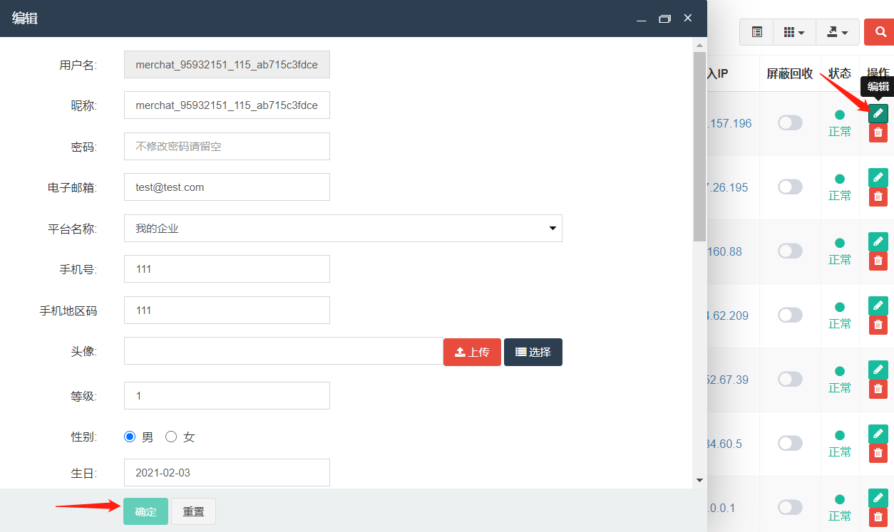

點擊要刪除的測試帳號操作欄的刪除按鈕，在彈出的提示頁面中確定即可完成刪除。

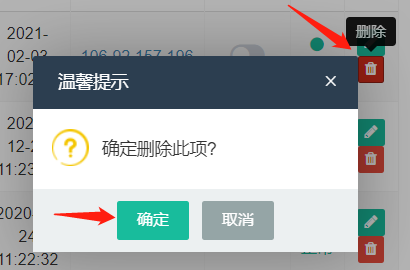

### 2.2 如何審核開發者？

展開許可權管理欄後，點擊展開部分中的開發者審核進入開發者審核頁面。

點擊要審核的資訊操作欄的審核詳情按鈕進入審核詳情頁面。通過在該頁面改變審核狀態的方式來表明審核結果。修改審核狀態並填寫審核建議後點擊審核詳情最下方的確定按鈕即保存審核結果。審核結果保存後，系統會將審核狀態和審核建議以公告的形式發送給被審核的平臺以通知本次審核的結果。審核狀態被修改為“審核通過”的平臺即為通過審核，可以正常使用平臺功能；審核狀態被修改為“審核未通過”的平臺即為不通過審核，需要按審核建議修改審核資訊後重新發起審核申請。

審核詳情頁面中出現的欄位如下：

平臺名稱：該欄位代表要審核的平臺的平臺名稱，僅供查看無法修改。

管理員帳戶：該欄位代表要審核的平臺的管理員帳號的用戶名，僅供查看無法修改。

企業/個人名稱：該欄位代表要審核的平臺提交審核申請時填寫的企業名稱，僅供查看無法修改。

補充說明：該欄位代表要審核的平臺提交審核申請時填寫的企業簡介，僅供查看無法修改。

上傳圖片：該欄位代表要審核的平臺提交審核申請時上傳的圖片，僅供查看無法修改

狀態：預設值為待審核，該欄位代表要審核的平臺的審核狀態，僅能在待審核、審核通過、審核未通過3個選項中進行選擇。

審核建議：預設值為空，該欄位代表此次審核中將發送給要審核的平臺的審核建議。**如不填寫則會提示“審核建議不能為空”導致審核失敗。**

點擊要刪除的審核資訊操作欄的刪除按鈕，在彈出的提示頁面中確定即可完成刪除。

## 3 CMS管理詳解

點擊左側巡覽列中的CMS管理可將其展開。

### 3.1 如何管理欄目？

展開CMS管理欄後，點擊展開部分中的欄目管理進入欄目管理頁面。

點擊添加按鈕打開添加頁面，在打開的添加頁面中完善資訊後點擊添加頁面最下方的確定按鈕即可完成添加。

**注意：欄目儘量不要隨意變動，如有需要，先聯繫總管理員。**

可添加的欄位如下：

類型：預設值為欄目，該欄位代表要添加的欄目的類型，僅能在欄目、清單、外部連結3個選項中進行選擇。欄目類型下不可以發佈文章,但可以添加子欄目、清單、連結；列表類型下可以發佈文章,但不能添加子欄目；連結類型下不可以發佈文章和子級欄目。同時，根據所選擇的類型，剩餘欄位也會出現區別。

模型ID：僅在類型為欄目或列表時出現的欄位，該欄位代表要添加的欄目使用的模型的模型名稱，使用者需在下拉式功能表的所有模型中任選一個模型。

上級欄目：預設值為“無”，該欄位代表要添加的欄目的上級欄目，用戶需在下拉式功能表的所有欄目中任選一個欄目或在要添加的欄目沒有上級欄目時選擇“無”。

名稱：預設值為空，該欄位代表要添加的欄目的名稱，不能為純數字。如不填寫則會提示“名稱不能為空”導致添加失敗。如果需要一次錄入多個分類時請換行輸入，錄入多個時將忽略自訂名稱，批量錄入格式為：分類名稱\|自訂名稱。

圖片：預設值為空，該欄位代表要添加的欄目的圖片。使用者可點擊右側上傳按鈕上傳圖片或直接填入圖片連結位址。

關鍵字：僅在類型為欄目或列表時出現的欄位，預設值為空，該欄位代表要添加的欄目的關鍵字。

描述：僅在類型為欄目或列表時出現的欄位，預設值為空，該欄位代表要添加的欄目的描述。

自訂名稱：預設值為空，該欄位代表要添加的欄目的自訂名稱，不能為純數字。如不填寫則會提示“自訂名稱格式不正確”導致添加失敗。

欄目頁範本：僅在類型為欄目時出現的欄位，預設值為模型ID所選擇的模型的欄目頁範本，該欄位表示新創建的欄目使用的模型的的欄目頁範本。使用者可自行填寫以channel開頭的自訂範本檔案名或點擊右側箭頭在下拉式功能表中選擇預設的範本檔channel.html。

清單頁範本：僅在類型為列表時出現的欄位，預設值為模型ID所選擇的模型的清單頁範本，該欄位表示新創建的欄目使用的模型的的清單頁範本。使用者可自行填寫以list開頭的自訂範本檔案名或點擊右側箭頭在下拉式功能表中在預設的範本檔list_news.html和list_product.html中選擇。

詳情頁範本：僅在類型為列表時出現的欄位，預設值為模型ID所選擇的模型的詳情頁範本，該欄位表示新創建的欄目使用的模型的欄目頁範本。使用者可自行填寫以show開頭的自訂範本檔案名或點擊右側箭頭在下拉式功能表中在預設的範本檔show_product.html、show_info.html、show_news.html和show_content.html中選擇。

分頁大小：僅在類型為列表時出現的欄位，預設值為10，僅允許填入數字，該欄位表示新創建的欄目中分頁的大小。

外部連結：僅在類型為外部連結時出現的欄位，預設值為空，該欄位表示新創建的欄目的外部連結位址，如不填寫則會提示“外部連結不能為空”導致添加失敗。

狀態：預設值為正常，該欄位代表要添加的欄目的狀態，僅能在正常和隱藏2個選項中進行選擇。

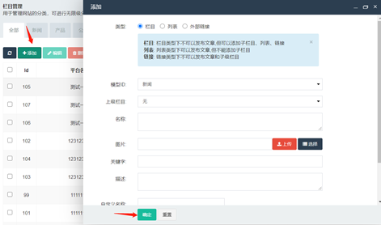

點擊要修改的欄目操作欄的編輯按鈕，在打開的編輯頁面中完成資訊編輯後點擊編輯頁面最下方的確定按鈕即可完成修改。

**注意：欄目儘量不要隨意變動，如有需要，先聯繫總管理員。**

可修改欄位除以下三點外，欄位含義和限制均與可添加欄位中對各欄位的介紹相同：

1、各欄位預設值為要修改的欄目添加時用戶填入或選擇的值。

2、類型和模型ID僅可查看不可被修改。

3、增加可供修改的新欄位權重，該欄位僅允許填入數字，該欄位代表在欄目管理頁面中該欄目的權重值，權重值越高的欄目在欄目管理表格中出現得越靠前。

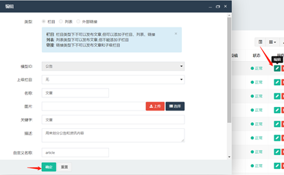

點擊要刪除的欄目操作欄的刪除按鈕，在彈出的提示頁面中確定即可完成刪除。

### 3.2 如何管理內容？

展開CMS管理欄後，點擊展開部分中的內容管理進入內容管理頁面。

因內容管理中會使用到已創建的欄目，建議進行內容管理流程前先進行欄目管理。

點擊添加按鈕打開添加頁面，在打開的添加頁面中完善資訊後點擊添加頁面最下方的確定按鈕即可完成添加。

可添加的欄位如下：

基礎資訊部分

欄目ID：該欄位代表要添加的內容使用的欄目的欄目名稱，用戶需在下拉式功能表的所有欄目中任選一個欄目。

發佈會員：預設值為空，該欄位代表要添加的內容的發佈會員，可為空。

文章標題：預設值為空，該欄位代表要添加的內容的文章標題，如不填寫則會提示“文章標題不能為空”導致添加失敗。

縮略圖：預設值為空，該欄位代表要添加的內容的縮略圖。使用者可點擊右側上傳按鈕上傳圖片或直接填入圖片連結位址。

TAG：預設值為空，該欄位代表要添加的內容的標籤。用戶可以手動輸入或或點擊右側箭頭在下拉式功能表中選擇預設的標籤。

自訂URL：預設值為空，該欄位代表要添加的內容的自訂URL，若為空將自動使用主鍵ID。

內容：預設值為空，該欄位代表要添加的內容，使用者可使用富文字編輯器輔助編輯。如不填寫則會提示“內容不能為空”導致添加失敗。

關鍵字：預設值為空，該欄位代表要添加的內容的關鍵字。

描述：預設值為空，該欄位代表要添加的內容的描述。

相關資訊部分

流覽：預設值為0，僅允許填入數位，填入小於0的數位保存後會自動重置回0。該欄位代表要添加的內容的被流覽次數。

評論：預設值為0，僅允許填入數位，填入小於0的數位保存後會自動重置回0。該欄位代表要添加的內容的被評論次數。

點贊：預設值為0，僅允許填入數位，填入小於0的數位保存後會自動重置回0。該欄位代表要添加的內容的被點贊次數。

點踩：預設值為0，僅允許填入數位，填入小於0的數位保存後會自動重置回0。該欄位代表要添加的內容的被點踩次數。

狀態部分

標誌：預設值為沒有選中任何項，該欄位表示要添加的內容的標誌，點擊右側箭頭在下拉式功能表中預設的三個標誌熱門、NEW、推薦中可以選擇一項或多項。

狀態：預設值為正常，該欄位表示要添加的內容的狀態，僅可在通過點擊右側箭頭在下拉式功能表中出現的預設的四個狀態正常、隱藏、已拒絕、以下線中選擇。

發佈：預設值為當前日期的00:00:00，該欄位表示要添加的內容的發佈時間，僅支持時間格式。

點擊要修改的內容操作欄的編輯按鈕，在打開的編輯頁面中完成資訊編輯後點擊編輯頁面最下方的確定按鈕即可完成修改。

可修改欄位除以下兩點外，欄位含義和限制均與可添加欄位中對各欄位的介紹相同：

1、各欄位預設值為要修改的內容添加時使用者填入或選擇的值。

2、增加可供修改的新欄位權重，該欄位僅允許填入數字，該欄位代表在內容管理頁面中該內容的權重值，權重值越高的內容在內容管理表格中出現得越靠前。

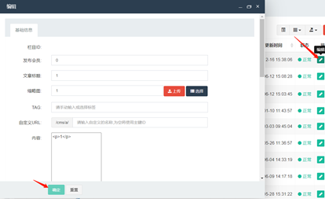

點擊要刪除的內容操作欄的刪除按鈕，在彈出的提示頁面中確定即可完成刪除。

**注意：請自行確認刪除的內容不會影響到用戶端App顯示，如有問題請聯繫總管理員。**

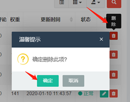

### 3.3 如何管理單頁？

展開CMS管理欄後，點擊展開部分中的單頁管理進入單頁管理頁面。

點擊添加按鈕打開添加頁面，在打開的添加頁面中完善資訊後點擊添加頁面最下方的確定按鈕即可完成添加。

**注意：單頁的作用與用戶端App密切相關，如要新增，請聯繫總管理員進行協調。**

可添加的欄位如下：

類型：預設值為空，該欄位代表要添加的單頁的類型。用戶可以手動填寫自訂類型或或點擊右側箭頭在下拉式功能表中選擇預設的類型page。如不填寫則會提示“類型不能為空”導致添加失敗。

平臺名稱：該欄位代表要添加的單頁所歸屬的平臺，用戶需在下拉式功能表中的所有平臺中選擇任一平臺。

標題：預設值為空，該欄位代表要添加的單頁的標題。如不填寫則會提示“標題不能為空”導致添加失敗。

關鍵字：預設值為空，該欄位代表要添加的單頁的關鍵字。

描述：預設值為空，該欄位代表要添加的單頁的描述。

標誌：預設值為沒有選中任何項，該欄位表示要添加的單頁的標誌，點擊右側箭頭在下拉式功能表中預設的三個標誌熱門、首頁、推薦中可以選擇一項或多項。

圖片：預設值為空，該欄位代表要添加的單頁的圖片。使用者可點擊右側上傳按鈕上傳圖片或直接填入圖片連結位址。

內容：預設值為空，該欄位代表要添加的內容，使用者可使用富文字編輯器輔助編輯。

自訂：預設值為空，該欄位代表要添加的單頁的自訂內容。如不填寫則會提示“自訂不能為空”導致添加失敗。

視圖範本：預設值為空，該欄位表示要添加的單頁使用的視圖範本。使用者可自行填寫以page開頭的自訂範本檔案名或點擊右側箭頭在下拉式功能表中選擇預設的範本檔page.html。

權重：預設值為0，該欄位僅允許填入數字，該欄位代表在單頁管理頁面中該單頁的權重值，權重值越高的單頁在單頁管理表格中出現得越靠前。

狀態：預設值為正常，該欄位代表要添加的單頁的狀態，僅能在正常和隱藏2個選項中進行選擇。

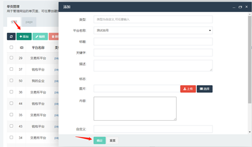

點擊要修改的單頁操作欄的編輯按鈕，在打開的編輯頁面中完成資訊編輯後點擊編輯頁面最下方的確定按鈕即可完成修改。

可修改欄位除以下兩點外，欄位含義和限制均與可添加欄位中對各欄位的介紹相同：

1、各欄位預設值為要修改的單頁添加時用戶填入或選擇的值。

2、增加如下可供修改的新欄位：

點擊：預設值為0，僅允許填入數位，填入小於0的數位保存後會自動重置回0。該欄位代表要修改的單頁的被點擊次數。

評論：預設值為0，僅允許填入數位，填入小於0的數位保存後會自動重置回0。該欄位代表要修改的單頁的被評論次數。

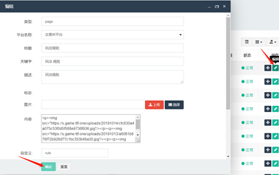

點擊要刪除的單頁操作欄的刪除按鈕，在彈出的提示頁面中確定即可完成刪除。

**注意：單頁的作用與用戶端App密切相關，請勿隨意刪除，如有需要，請聯繫總管理員。**

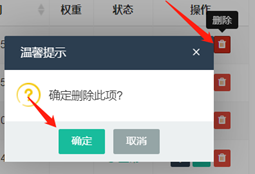

## 4 遊戲管理詳解

點擊左側巡覽列中的遊戲管理可將其展開。

### 4.1 如何審核遊戲？

展開遊戲管理欄後，點擊展開部分中的遊戲管理進入遊戲管理頁面。

點擊要審核的遊戲操作欄的審核詳情按鈕進入審核詳情頁面。通過在該頁面改變審核狀態的方式來表明審核結果。修改審核狀態並填寫審核建議後點擊審核詳情最下方的確定按鈕即保存審核結果。審核結果保存後，系統會將審核狀態和審核建議以公告的形式發送給被審核的平臺以通知本次審核的結果。審核狀態被修改為“審核通過”的遊戲即為通過審核，允許開發者發佈；審核狀態被修改為“審核未通過”的遊戲即為不通過審核，需要按審核建議修改審核資訊後重新發起審核申請。

審核詳情頁面中出現的欄位如下：

遊戲名稱：該欄位代表要審核的遊戲的名稱，僅供查看無法修改。

官方連結：該欄位代表要審核的遊戲的官方連結，僅供查看無法修改。

遊戲類型：該欄位代表要審核的遊戲的類型，僅供查看無法修改。  
APP類型：該欄位代表要審核的遊戲的APP類型，僅供查看無法修改。

標籤：該欄位代表要審核的遊戲的標籤，僅供查看無法修改。

圖示：該欄位代表要審核的遊戲的圖示，僅供查看無法修改。

推廣圖：該欄位代表要審核的遊戲的推廣圖，僅供查看無法修改。

是否橫屏：該欄位代表要審核的遊戲是否橫屏，僅供查看無法修改。

遊戲狀態：該欄位代表要審核的遊戲的狀態，僅供查看無法修改。

簡介：該欄位代表要審核的遊戲的簡介，僅供查看無法修改。

遊戲詳情：該欄位代表要審核的遊戲的詳情，僅供查看無法修改。

截圖：該欄位代表要審核的遊戲的截圖，僅供查看無法修改。

狀態：預設值為待審核，該欄位代表要審核的遊戲的審核狀態，僅能在待審核、審核通過、審核未通過3個選項中進行選擇。

審核建議：預設值為空，該欄位代表此次審核中將發送給要審核的遊戲所屬平臺的審核建議。如不填寫則會提示“審核建議不能為空”導致審核失敗。

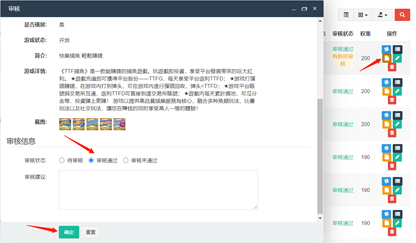

### 4.2 如何發佈或撤回遊戲？

展開遊戲管理欄後，點擊展開部分中的遊戲管理進入遊戲管理頁面。

只有審核狀態為通過審核的遊戲才支援進行發佈，審核流程請參閱本使用流程4.1

審核狀態為通過審核的遊戲的操作欄會額外增加發佈按鈕，點擊後在彈出的提示頁面中確定即可進行遊戲發佈。

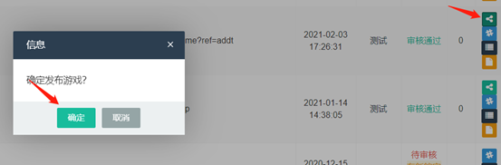

已發佈的遊戲操作欄中的發佈會變為遊戲撤回，點擊後在彈出的提示頁面中確定即可進行遊戲撤回。

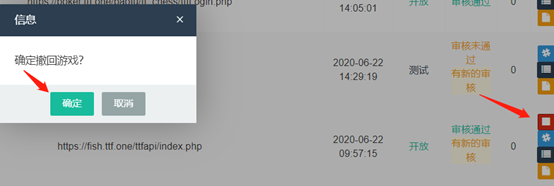

### 4.3 如何管理遊戲類型？

展開遊戲管理欄後，點擊展開部分中的類型管理進入類型管理頁面。

點擊添加按鈕打開添加頁面，在打開的添加頁面中完善資訊後點擊添加頁面最下方的確定按鈕即可完成添加。

可添加的欄位如下：

名稱：預設值為空，該欄位代表要添加的遊戲類型的名稱，如不填寫則會提示“名稱不能為空”導致添加失敗。

圖示：預設值為空，該欄位代表要添加的遊戲類型的圖示。使用者可點擊右側上傳按鈕上傳圖片或直接填入圖片連結位址。

權重：預設值為0，該欄位僅允許填入數字，該欄位代表在遊戲類型管理頁面中該類型的權重值，權重值越高的類型在類型管理表格中出現得越靠前。

平臺名稱：該欄位代表要添加的遊戲類型所歸屬的平臺，用戶需在下拉式功能表中的所有平臺中選擇任一平臺。

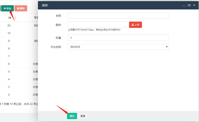

點擊要修改的類型操作欄的編輯按鈕，在打開的編輯頁面中完成資訊編輯後點擊編輯頁面最下方的確定按鈕即可完成修改。

可修改欄位除各欄位預設值為要修改的類型添加時用戶填入或選擇的值，欄位含義和限制均與可添加欄位中對各欄位的介紹相同。

點擊要刪除的類型操作欄的刪除按鈕，在彈出的提示頁面中確定即可完成刪除。

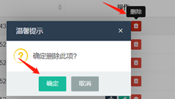

### 4.4 如何管理遊戲輪播圖？

展開遊戲管理欄後，點擊展開部分中的輪播圖管理進入輪播圖管理頁面。

點擊添加按鈕打開添加頁面，在打開的添加頁面中完善資訊後點擊添加頁面最下方的確定按鈕即可完成添加。

可添加的欄位如下，**除兩種輪播圖必須任選其一填寫以外，其餘均為必填**：

名稱：預設值為空，該欄位代表要添加的輪播圖的名稱，如不填寫則會提示“名稱不能為空”導致添加失敗。

類型：預設值為公告，該欄位代表要添加的輪播圖的類型，僅能在公告、資訊、單頁、遊戲、連結5個選項中進行選擇。

內容：預設值為空，該欄位代表要添加的輪播圖的內容，如不填寫則會提示“內容不能為空”導致添加失敗。

輪播圖（大）：預設值為空。該欄位代表要添加的輪播圖的大圖，用戶可點擊右側上傳按鈕上傳圖片或直接填入圖片連結位址。上傳圖片尺寸需為980\*380px,格式必須為JPG或PNG。

輪播圖（小）：預設值為空。該欄位代表要添加的輪播圖的小圖，用戶可點擊右側上傳按鈕上傳圖片或直接填入圖片連結位址。上傳圖片尺寸需為980\*100px,格式必須為JPG或PNG。

權重：預設值為0，該欄位僅允許填入數字，該欄位代表在遊戲輪播圖管理頁面中該輪播圖的權重值，權重值越高的輪播圖在輪播圖管理表格中出現得越靠前。

平臺名稱：該欄位代表要添加的遊戲輪播圖所歸屬的平臺，用戶需在下拉式功能表中的所有平臺中選擇任一平臺。

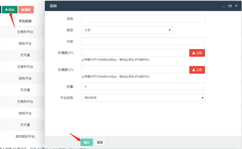

點擊要修改的輪播圖操作欄的編輯按鈕，在打開的編輯頁面中完成資訊編輯後點擊編輯頁面最下方的確定按鈕即可完成修改。

可修改欄位除各欄位預設值為要修改的輪播圖添加時用戶填入或選擇的值，欄位含義和限制均與可添加欄位中對各欄位的介紹相同。

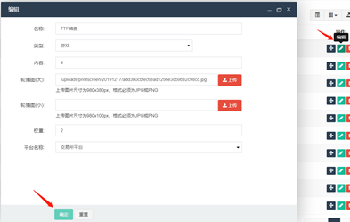

點擊要刪除的輪播圖操作欄的刪除按鈕，在彈出的提示頁面中確定即可完成刪除。

### 4.5 如何管理遊戲禮包？

展開遊戲管理欄後，點擊展開部分中的禮包管理進入禮包管理頁面。

點擊添加按鈕打開添加頁面，在打開的添加頁面中完善資訊後點擊添加頁面最下方的確定按鈕即可完成添加。

可添加的欄位如下，**所有欄位都必填，以確保用戶端App邏輯和顯示正常**：

名稱：預設值為空，該欄位代表要添加的禮包的名稱，如不填寫則會提示“名稱不能為空”導致添加失敗。

數量：預設值為空，該欄位代表要添加的禮包的數量，僅能填入數字，如不填寫則會提示“數量不能為空”導致添加失敗。

兌換碼：預設值為空，該欄位代表要添加的禮包的兌換碼，需填寫12個字元，如不填寫則會提示“請填寫12個字元”導致添加失敗。

平臺名稱：該欄位代表要添加的遊戲禮包所歸屬的平臺，用戶需在下拉式功能表中的所有平臺中選擇任一平臺。

遊戲名稱：該欄位代表要添加的遊戲禮包所歸屬的遊戲，用戶需在下拉式功能表中的所有屬於所選平臺的遊戲中選擇任一遊戲。

描述：預設值為空，該欄位代表要添加的禮包的描述。

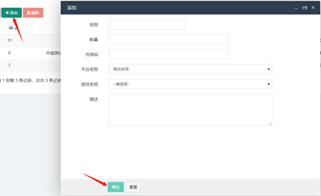

點擊要修改的禮包操作欄的編輯按鈕，在打開的編輯頁面中完成資訊編輯後點擊編輯頁面最下方的確定按鈕即可完成修改。

可修改欄位除各欄位預設值為要修改的禮包添加時用戶填入或選擇的值，欄位含義和限制均與可添加欄位中對各欄位的介紹相同。

點擊要刪除的禮包操作欄的刪除按鈕，在彈出的提示頁面中確定即可完成刪除。

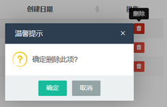

### 4.6 如何管理遊戲商品？

**目前接入的遊戲，不再在後臺管理商品。**

~~展開遊戲管理欄後，點擊展開部分中的商品管理進入商品管理頁面。~~

~~點擊添加按鈕打開添加頁面，在打開的添加頁面中完善資訊後點擊添加頁面最下方的確定按鈕即可完成添加。~~

~~可添加的欄位如下:~~

~~商品名稱：預設值為空，該欄位代表要添加的禮包的名稱，如不填寫則會提示“商品名稱不能為空”導致添加失敗。~~

~~TTFG：預設值為空，該欄位代表要添加的商品的TTFG，僅限填入數字，如不填寫則會提示“TTFG不能為空”導致添加失敗。~~

~~商品價格：預設值為空，該欄位代表要添加的商品的價格，僅限填入數字，如不填寫則會提示“商品價格不能為空”導致添加失敗。~~

~~所屬遊戲：該欄位代表要添加的商品所歸屬的遊戲，用戶需在下拉式功能表中的所有遊戲中選擇任一遊戲。~~

~~商品描述：預設值為空，該欄位代表要添加的商品的描述，如不填寫則會提示“商品描述不能為空”導致添加失敗。~~

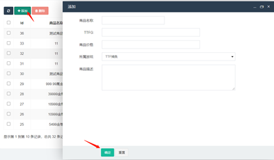

~~點擊要修改的商品操作欄的編輯按鈕，在打開的編輯頁面中完成資訊編輯後點擊編輯頁面最下方的確定按鈕即可完成修改。~~

~~可修改欄位除各欄位預設值為要修改的商品添加時用戶填入或選擇的值，欄位含義和限制均與可添加欄位中對各欄位的介紹相同。~~

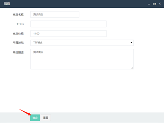

~~點擊要刪除的商品操作欄的刪除按鈕，在彈出的提示頁面中確定即可完成刪除。~~

## 5 平臺資訊詳解

點擊左側巡覽列中的平臺資訊可將其展開。

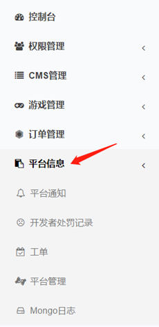

### 5.1 如何管理平臺通知？

展開平臺資訊欄後，點擊展開部分中的平臺通知進入平臺通知管理頁面。

點擊添加按鈕打開添加頁面，在打開的添加頁面中完善資訊後點擊添加頁面最下方的確定按鈕即可完成添加。

可添加的欄位如下：

標題：預設值為空，該欄位代表要添加的平臺通知的標題，如不填寫則會提示“標題不能為空”導致添加失敗。

指定通知目標：預設值為“如果不選擇，表示向所有用戶”，該欄位代表要添加的平臺通知的指定通知目標。使用者點擊右側選擇按鈕打開選擇介面後，可以在所有用戶中勾選一個或多個目標。若用戶不選擇，則預設所有使用者均為目標。

備註：預設值為空，該欄位代表要添加的平臺通知的備註，如不填寫則會提示“備註不能為空”導致添加失敗。

狀態：預設值為顯示，該欄位代表要添加的單頁的狀態，僅能在顯示和隱藏2個選項中進行選擇。隱藏表示指在後臺添加，而不對開發者和管理員展示。

內容：預設值為空，該欄位代表要添加的平臺通知的內容，如不填寫則會提示“內容不能為空”導致添加失敗。

點擊要修改的平臺通知操作欄的編輯按鈕，在打開的編輯頁面中完成資訊編輯後點擊編輯頁面最下方的確定按鈕即可完成修改。

可修改欄位除以下兩點外，欄位含義和限制均與可添加欄位中對各欄位的介紹相同：

1、各欄位預設值為要修改的平臺通知添加時用戶填入或選擇的值。

2、指定通知目標不可被修改。

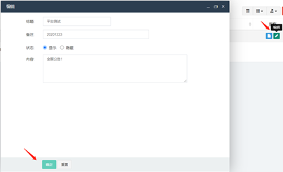

### 5.2 如何處罰開發者？

展開平臺資訊欄後，點擊展開部分中的開發者處罰記錄進入開發者處罰管理頁面。

點擊添加按鈕打開添加頁面，在打開的添加頁面中完善資訊後點擊添加頁面最下方的確定按鈕即可完成添加。

可添加的欄位如下：

開發者：該欄位代表要添加的處罰所處罰的開發者的用戶名，用戶需在下拉式功能表中的所有開發者中選擇任一開發者。

懲罰類型：預設值為禁止平臺提幣，該欄位代表要添加的處罰的類型，僅能在禁止平臺提幣、禁止遊戲充值、禁止用戶登錄、禁止平臺登錄4個選項中進行選擇。

處罰描述：預設值為空，該欄位代表要添加的處罰的描述，如不填寫則會提示“處罰描述不能為空”導致添加失敗。

期限：預設值為永久，該欄位代表要添加的處罰的期限，僅能在永久、一周。一個月3個選項中進行選擇。

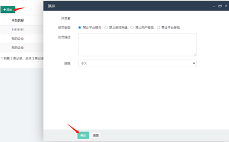

點擊要修改的處罰操作欄的編輯按鈕，在打開的編輯頁面中完成資訊編輯後點擊編輯頁面最下方的確定按鈕即可完成修改。

可修改欄位除以下兩點外，欄位含義和限制均與可添加欄位中對各欄位的介紹相同：

1、各欄位預設值為要修改的處罰添加時用戶填入或選擇的值。

2、增加可修改的新欄位狀態，該欄位預設值為執行，代表要修改的處罰的狀態，僅能在執行、取消2個選項中進行選擇。

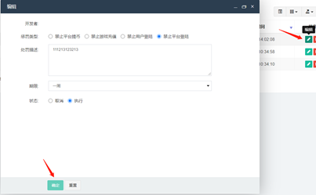

點擊要刪除的處罰操作欄的刪除按鈕，在彈出的提示頁面中確定即可完成刪除。

### 5.3 如何管理平臺？

展開平臺資訊欄後，點擊展開部分中的平臺管理進入平臺管理頁面。

點擊添加按鈕打開添加頁面，在打開的添加頁面中完善資訊後點擊添加頁面最下方的確定按鈕即可完成添加。

可添加的欄位如下：

應用名稱：預設值為空，該欄位代表要添加的平臺的應用名稱，如不填寫則會提示“應用名稱不能為空”導致添加失敗。

類名:預設值為空，該欄位代表要添加的平臺的類名，如不填寫則會提示“類名不能為空”導致添加失敗。

白名單IP：預設值為空，該欄位代表要添加的平臺的白名單IP。

黑名單IP：預設值為空，該欄位代表要添加的平臺的黑名單IP。

權重：預設值為0，該欄位僅允許填入數字，該欄位代表在平臺管理頁面中該平臺的權重值，權重值越高的平臺在平臺管理表格中出現得越靠前。

備註：預設值為空，該欄位代表要添加的平臺的備註，如不填寫則會提示“備註不能為空”導致添加失敗。

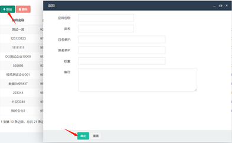

點擊要修改的平臺操作欄的編輯按鈕，在打開的編輯頁面中完成資訊編輯後點擊編輯頁面最下方的確定按鈕即可完成修改。

可修改的欄位如下：

應用名稱：預設值為添加時用戶所填寫的應用名稱，該欄位代表要修改的平臺的應用名稱，如不填寫則會提示“應用名稱不能為空”導致添加失敗。

應用金鑰：預設值為系統隨機生成，該欄位代表要添加的平臺的應用金鑰，不支持用戶手動修改，僅支援用戶點擊右側更換金鑰按鈕後重新生成新的應用金鑰。

類名：預設值為添加時用戶所填寫的應用名稱，該欄位代表要修改的平臺的類名。

GP Id：預設值為空，該欄位代表要修改的平臺的GP Id。

黑名單IP：預設值為添加時用戶所填寫的黑名單IP，該欄位代表要修改的平臺的黑名單IP。

權重：預設值為添加時用戶所填寫的權重，該欄位僅允許填入數字，該欄位代表在平臺管理頁面中該平臺的權重值，權重值越高的平臺在平臺管理表格中出現得越靠前。

備註：預設值為添加時用戶所填寫的備註，該欄位代表要修改的平臺的備註，如不填寫則會提示“備註不能為空”導致添加失敗。

點擊要刪除的平臺操作欄的刪除按鈕，在彈出的提示頁面中確定即可完成刪除。**建議不要刪除平臺！**

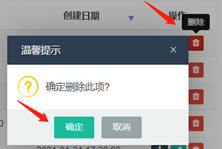

## 6 活動管理詳解

點擊左側巡覽列中的活動管理可將其展開。

### 6.1 如何管理積分抽獎？

展開活動管理欄後，點擊展開部分中的積分抽獎管理進入積分抽獎管理頁面。

點擊添加按鈕打開添加頁面，在打開的添加頁面中完善資訊後點擊添加頁面最下方的確定按鈕即可完成添加。

可添加的欄位如下：

平臺名稱：該欄位代表要添加的積分抽獎所屬平臺的名稱，用戶需在下拉式功能表中的所有平臺中選擇任一平臺。

名稱：預設值為空，該欄位代表要添加的積分抽獎的名稱，如不填寫則會提示“名稱不能為空”導致添加失敗。

值：預設值為0，該欄位僅允許填入數字，該欄位代表要添加的積分抽獎的值。

兌換積分：預設值為0，該欄位僅允許填入數字，該欄位代表要添加的積分抽獎的兌換積分。

類型：預設值為空，該欄位代表要添加的積分抽獎的類型，僅能在空、積分、TTFD/TTFG3個選項中進行選擇。

大輸：預設值為0，該欄位僅允許填入數字，該欄位代表要添加的積分抽獎大輸的值。

小輸：預設值為0，該欄位僅允許填入數字，該欄位代表要添加的積分抽獎小輸的值。

小贏：預設值為0，該欄位僅允許填入數字，該欄位代表要添加的積分抽獎小贏的值。

大贏：預設值為0，該欄位僅允許填入數字，該欄位代表要添加的積分抽獎大贏的值。

排序：預設值為99，該欄位僅允許填入數字，該欄位代表積分抽獎頁面中該抽獎的排序，排序越高的抽獎在積分抽獎管理表格中出現得越靠前。

點擊要修改的積分抽獎資訊操作欄的編輯按鈕，在打開的編輯頁面中完成資訊編輯後點擊編輯頁面最下方的確定按鈕即可完成修改。

可修改欄位除各欄位預設值為要修改的商品添加時用戶填入或選擇的值，欄位含義和限制均與可添加欄位中對各欄位的介紹相同。

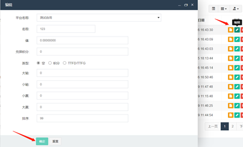

點擊要刪除的積分抽獎資訊操作欄的刪除按鈕，在彈出的提示頁面中確定即可完成刪除。

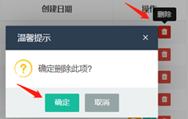

### 6.2 如何管理合約？

展開活動管理欄後，點擊展開部分中的合約管理進入合約管理頁面。

點擊添加按鈕打開添加頁面，在打開的添加頁面中完善資訊後點擊添加頁面最下方的確定按鈕即可完成添加。

可添加的欄位如下：

合約名稱：預設值為空，該欄位代表要添加的合約的名稱，如不填寫則會提示“名稱不能為空”導致添加失敗。

平臺名稱：該欄位代表要添加的合約所屬平臺的名稱，用戶需在下拉式功能表中的所有平臺中選擇任一平臺。

開始時間：預設值為空，該欄位表示要添加的合約的開始時間（即合約何時開放購買），僅支持時間格式。如不填寫則會提示“開始時間不能為空”導致添加失敗。

結束時間：預設值為空，該欄位表示要添加的合約的結束時間（即合約何時停止購買，可在購買期內延長，但購買結束後，不可再更改），僅支持時間格式。如不填寫則會提示“結束時間不能為空”導致添加失敗。

存入幣種：預設值為BTC，該欄位代表要添加的合約的存入幣種，僅能在BTC、DDMX、USDT、TTFG、ANTS、TTFD6個選項中進行選擇。

收益幣種：預設值為BTC，該欄位代表要添加的合約的收益幣種，僅能在BTC、DDMX、USDT、TTFG、ANTS、TTFD6個選項中進行選擇。

幣種匯率：預設值為空，該欄位僅允許填入數字，該欄位代表要添加的合約的存入幣種與收益幣種不同時兩者之間的匯率，合約開始購買後不能修改。如不填寫則會提示“幣種匯率不能為空”導致添加失敗。

合約單價：預設值為空，該欄位僅允許填入數字，該欄位代表一份要添加的合約的單價金額。如不填寫則會提示“幣種匯率不能為空”導致添加失敗。

合約天數：預設值為空，該欄位僅允許填入數字，該欄位代表要添加的合約的收益天數。如不填寫則會提示“合約天數不能為空”導致添加失敗。

購買份數：預設值為空，該欄位僅允許填入數字，該欄位代表要添加的合約的限制購買份數。如不填寫則會提示“購買份數不能為空”導致添加失敗。

年化收益：預設值為空，該欄位僅允許填入數字，該欄位代表要添加的合約的年化率，填入數值，計算為數字/100。如不填寫則會提示“年化收益不能為空”導致添加失敗。

審核天數：預設值為空，該欄位僅允許填入數字，該欄位代表要添加的合約審核期的持續天數。如不填寫則會提示“審核天數不能為空”導致添加失敗。

解約返回比例：預設值為0，該欄位僅允許填入數字，該欄位代表要添加的合約收益期解約時返還剩餘本金的比例，填入數值，計算為數字/100。如不填寫則會提示“解約返回比例不能為空”導致添加失敗。

是否開啟：預設值為否，該欄位代表是否開啟前端顯示，點擊即可切換為是。

權重：預設值為0，該欄位僅允許填入數字，該欄位代表在合約管理頁面中該合約的權重值，權重值越高的合約在合約管理表格中出現得越靠前。

簡述：預設值為空，該欄位代表要添加的合約的特色簡述，如不填寫則會提示“簡述不能為空”導致添加失敗。

合約介紹：預設值為空，該欄位代表要添加的合約的詳細規則說明，使用者可使用富文字編輯器輔助編輯。如不填寫則會提示“合約介紹不能為空”導致添加失敗。

白名單：預設值為空，該欄位代表要添加的合約的白名單用戶ID，加入白名單的用戶可以看到並操作合約，多個用戶ID請用‘,’（半形）來分割。

點擊要修改的合約操作欄的編輯按鈕，在打開的編輯頁面中完成資訊編輯後點擊編輯頁面最下方的確定按鈕即可完成修改。

可修改欄位除以下兩點外，欄位含義和限制均與可添加欄位中對各欄位的介紹相同：

1、各欄位預設值為要修改的合約添加時用戶填入或選擇的值。

2、開始時間、存入幣種、收益幣種、幣種匯率、合約單價、合約天數、購買份數、年化收益、審核天數、解約返回比例僅可查看不可被修改。

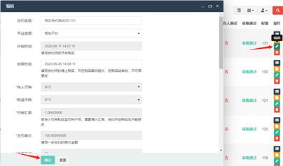

點擊要刪除的合約操作欄的刪除按鈕，在彈出的提示頁面中確定即可完成刪除。

 

▶ 各頁面介紹

## 1 控制台

初始頁面。通過本頁面可獲取許可權許可內的即時資料和當前的伺服器資訊。

同時，也支持進行流覽量與啟動量的查詢並生成相對應的圖表。

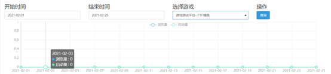

## 2 常規管理

管理員可使用常規管理下的所有頁面，管理員協作者不支援使用常規管理下的任何頁面。

### 2.1 系統組態

該頁面僅管理員可使用。管理員通過此介面可增改系統的變數和分組，同時也支援對分組和變數的自訂。最上方的“選擇平臺”支援切換不同平臺進行系統組態，目前每個平臺提供十個不同的系統變數分組：字典配置，交易設置，返利設置，貢獻配置，抽獎設置，安全性原則，合約設置，支付方式，TTFD售價，提幣設置。

### 2.2 附件管理

該頁面僅管理員可使用，管理員通過此頁面可查看並管理上傳到伺服器或協力廠商存儲的資料。

### 2.3 個人配置

分為左側個人配置與右側操作日誌兩個部分。

個人配置部分中使用者可獲取個人資訊，同時允許使用者對除用戶名之外的資訊進行修改。

操作日誌部分中僅允許使用者查看在本平臺中進行的所有操作資訊，不支援增刪改查。

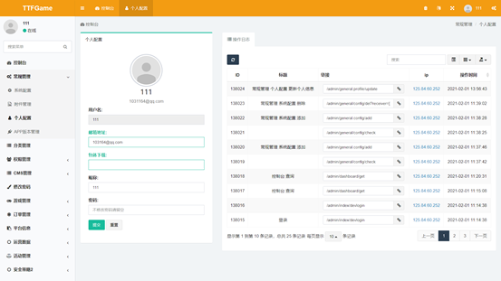

### 2.4 APP版本管理

該頁面僅管理員可使用，管理員可通過此頁面查看並管理各個版本APP的資訊。

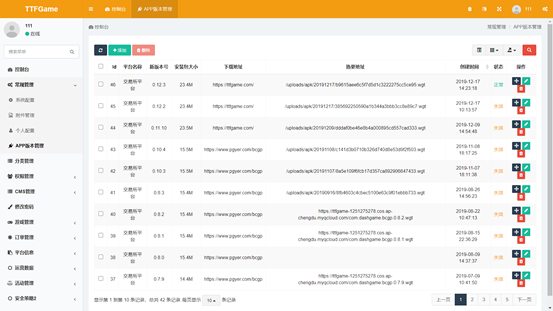

## 3 分類管理

僅支持管理員使用，用於統一管理所有網站的分類，分類可進行無限級分類。支援對各個分類資訊進行查看。

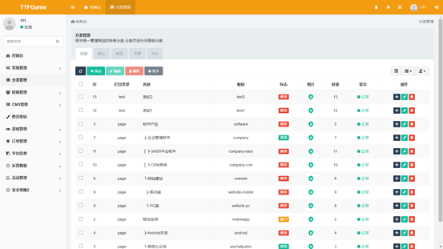

## 4 許可權管理

管理員可使用權限管理下的所有分頁，管理員協作者和開發者可使用權限管理下的部分分頁，開發者協作者不可使用權限管理。

### 4.1 協作者管理

該頁面管理員可使用。

管理員可在本頁面中獲取自己及其餘管理員協作者，開發者與開發者協作者的資訊。

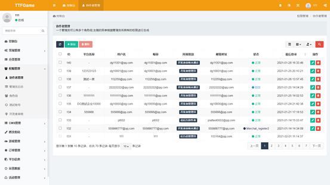

### 4.2 管理員日誌

該頁面管理員，管理員協作者均可使用。平臺使用者可通過該頁面根據自己的許可權查看對應的管理員日誌。

管理員可在本頁面中獲取自己及其餘管理員協作者，開發者與開發者協作者的日誌資訊。

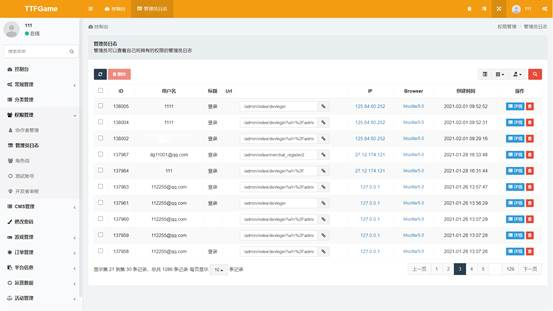

管理員協作者僅能獲取自己的日誌資訊。

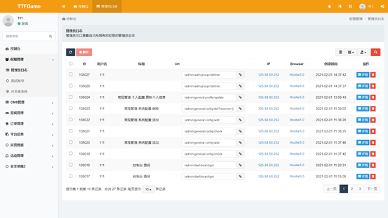

日誌資訊允許使用者進行查詢與刪除操作，不允許進行添加與修改操作。

### 4.3 角色組

該頁面僅管理員可使用。管理員可在此查看並編輯擁有上下級層次關係的多個角色組。

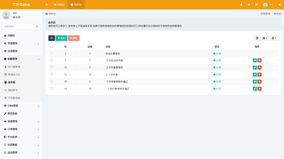

點擊編輯按鈕後即進入對應角色組的編輯頁面，該頁面中可修改對應角色組的父級，名稱和許可權。

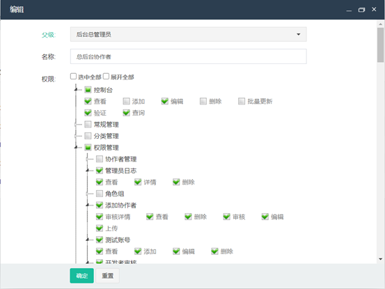

### 4.4 測試帳號

該頁面管理員，管理員協作者均可使用。平臺使用者可通過該頁面根據自己的許可權查看對應的測試帳號資訊。

管理員與管理員協作者可查看全平臺的測試帳號。

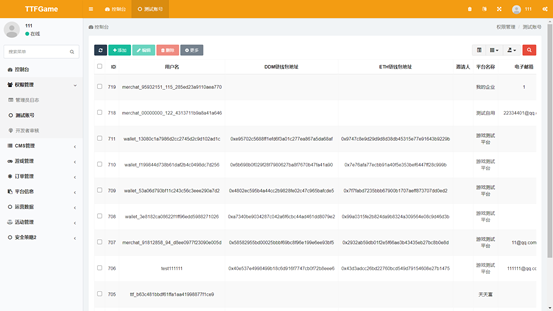

### 4.5 開發者審核

該頁面管理員與管理員協作者均可使用。管理員與管理員協作者可在該頁面查看開發者與開發者協作者的審核申請資訊。僅支援查看，刪除和修改操作，不支援添加操作。

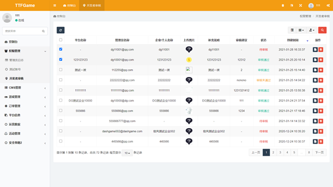

審核資訊僅支援修改狀態和審核建議。點擊任一條審核資訊操作欄中的審核詳情按鈕進入審核詳情頁面，通過在該頁面下修改狀態和審核建議以達到令該條審核資訊通過或未通過並將審核建議以平臺通知的形式自動發送給該條審核資訊的申請者的效果。

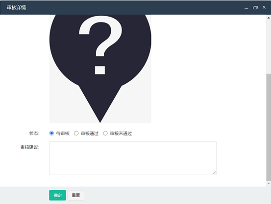

## 5 CMS管理

管理員與管理員協作者可使用CMS管理下的所有頁面。

### 5.1 內容管理

該頁面管理員，管理員協作者均可使用。平臺使用者可根據自身許可權於本頁面查看各個欄目下的文章列表。

管理員與管理員協作者可查看管理所有平臺下所有欄目中的文章。

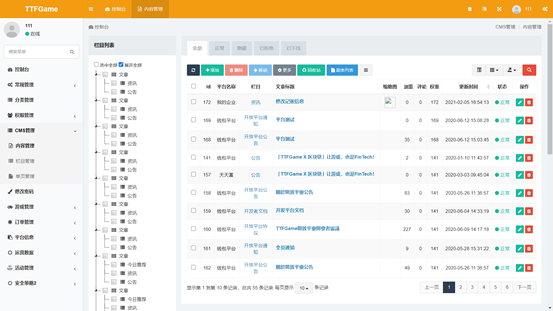

### 5.2 欄目管理

該頁面管理員與管理員協作者均可使用。通過該頁面可查看全平臺下所有欄目的欄目資訊，管理網站的分類。

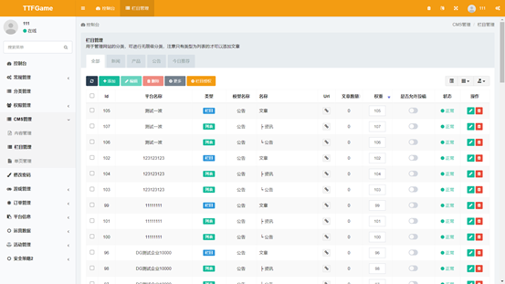

### 5.3 單頁管理

該頁面管理員，管理員協作者均可使用。平臺使用者可根據自身許可權於本頁面查看管理網站中的單頁面。

管理員與管理員協作者可查看管理所有平臺下的單頁。

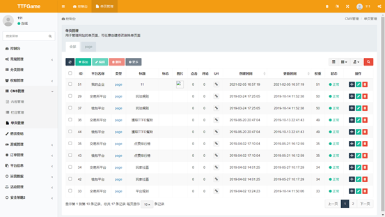

## 6 修改密碼

該頁面中使用者可以修改新的登錄密碼。

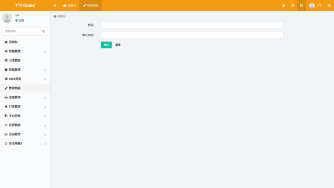

## 7 遊戲管理

管理員可使用遊戲管理下的所有頁面。管理員協作者僅可使用遊戲管理下的部分頁面。

### 7.1 遊戲接入

該頁面管理員可使用。通過該頁面使用者可以查看並管理遊戲接入資訊。僅支持用戶進行搜索，修改和刪除操作，不支持添加操作。

管理員可以查看管理所有平臺遊戲的遊戲接入資訊，同時支援在本頁面對這些遊戲進行遊戲發佈或撤回。

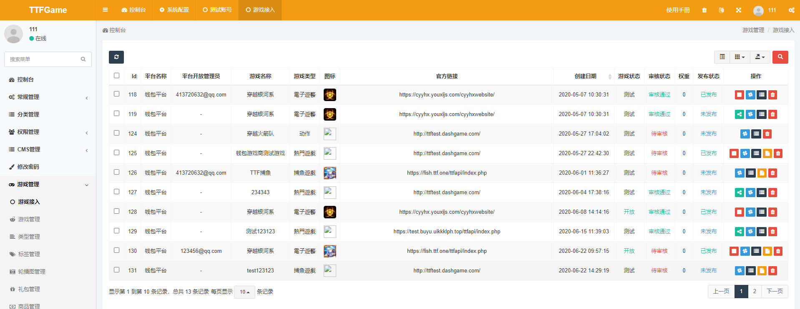

### 7.2 遊戲管理

該頁面所有平臺使用者皆可使用。通過本頁面使用者可查看管理遊戲資訊。

管理員與管理員協作者可查看管理所有平臺的全部遊戲資訊，同時支援進行遊戲資訊審核。

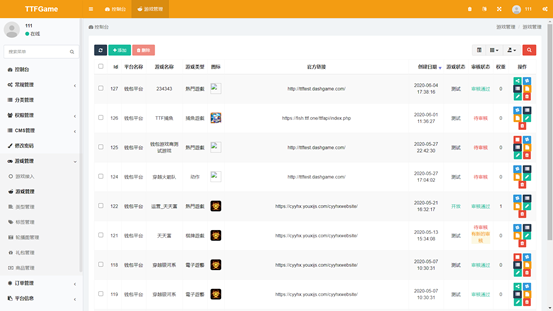

### 7.3 類型管理

該頁面所有平臺使用者皆可使用。通過本頁面使用者可查看管理遊戲類型資訊。

管理員與管理員協作者可查看管理所有平臺全部遊戲的類型資訊。

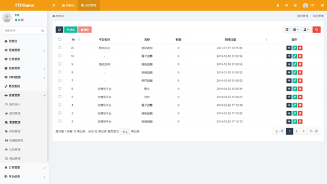

### 7.4 標籤管理

該頁面所有平臺使用者皆可使用。通過本頁面使用者可查看遊戲標籤資訊，不支援添加，修改和刪除。

管理員與管理員協作者可查看所有平臺全部遊戲的標籤資訊。

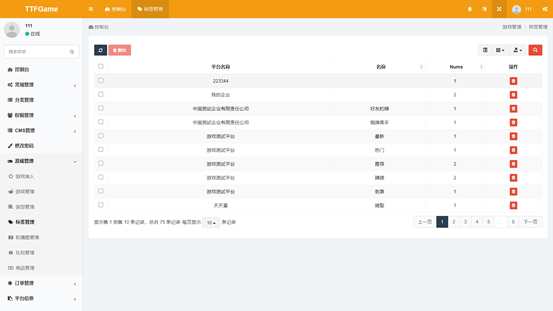

### 7.5 輪播圖管理

該頁面所有平臺使用者皆可使用。通過本頁面使用者可查看管理輪播圖資訊。

管理員與管理員協作者可查看管理所有平臺全部遊戲的輪播圖資訊。

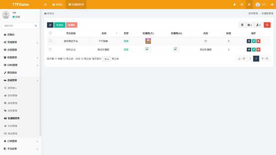

### 7.6 禮包管理

本頁面管理員，管理員協作者均可使用。通過本頁面使用者可查看管理遊戲禮包資訊。

管理員與管理員協作者可查看管理所有平臺全部遊戲的禮包資訊。

### 7.7 商品管理

本頁面管理員，管理員協作者均可使用。通過本頁面使用者可查看管理遊戲商品資訊。

管理員與管理員協作者可查看管理所有平臺全部遊戲的商品資訊。

## 8 訂單管理

管理員與管理員協作者均可使用訂單管理下的所有頁面。訂單管理下的所有頁面均只支援使用者查看或搜索，不支援添加修改和刪除操作。

### 8.1 提幣訂單

本頁面管理員，管理員協作者均可使用。通過本頁面使用者可查看提幣訂單資訊。

管理員與管理員協作者可查看所有平臺的提幣訂單資訊。

### 8.2 交易訂單

本頁面管理員與管理員協作者均可使用。通過本頁面使用者可查看所有平臺的交易訂單資訊。

### 8.3 遊戲充值訂單

本頁面所有使用者均可使用。通過本頁面使用者可查看遊戲充值訂單資訊。

管理員與管理員協作者可查看所有平臺的遊戲充值訂單資訊。

### 8.4 分紅訂單

本頁面管理員與管理員協作者均可使用。通過本頁面使用者可查看所有平臺的分紅訂單資訊。

### 8.5 回收訂單

本頁面所有使用者均可使用。通過本頁面使用者可查看回收訂單資訊。

管理員與管理員協作者可查看所有平臺的回收訂單資訊。

### 8.6 平臺充值訂單

本頁面管理員，管理員協作者與開發者均可使用。通過本頁面使用者可查看平臺充值訂單資訊。

管理員與管理員協作者可查看所有平臺的平臺充值訂單資訊。

### 8.7 積分抽獎訂單

本頁面管理員與管理員協作者均可使用。通過本頁面使用者可查看所有平臺的積分抽獎訂單資訊。

### 8.8 使用者發送訂單

本頁面管理員與管理員協作者均可使用。通過本頁面使用者可查看所有平臺的使用者發送訂單資訊。

### 8.9 商戶流水（DDM）

本頁面管理員，管理員協作者均可使用。通過本頁面使用者可查看商戶流水(DDM)資訊。

管理員與管理員協作者可查看所有平臺的商戶流水(DDM)資訊。

### 8.10 理財購買訂單

本頁面管理員，管理員協作者均可使用。通過本頁面使用者可查看理財購買訂單資訊。

管理員與管理員協作者可查看所有平臺的理財購買訂單資訊。

### 8.11 理財收益訂單

本頁面管理員，管理員協作者均可使用。通過本頁面使用者可查看理財收益訂單資訊。

管理員與管理員協作者可查看所有平臺的理財收益訂單資訊。

### 8.12 理財解約訂單

本頁面管理員，管理員協作者均可使用。通過本頁面使用者可查看理財解約訂單資訊。

管理員與管理員協作者可查看所有平臺的理財解約訂單資訊。

## 9 平臺資訊

管理員與管理員協作者均可使用平臺資訊下的所有頁面。開發者和開發者協作者僅可使用平臺資訊下的部分頁面。

### 9.1 平臺通知

本頁面所有使用者均可使用。通過本頁面使用者可以查看與管理平臺通知，同時支援使用者根據許可權的不同進行平臺通知的發送或接收操作。

管理員與管理員協作者可通過本頁面進行添加操作以發送平臺通知。本頁面僅支援搜索，添加與修改，不支援刪除操作。

### 9.2 開發者處罰記錄

本頁面管理員，管理員協作者均可使用。通過本頁面使用者根據許可權不同可查看或管理開發者處罰記錄資訊。

管理員與管理員協作者可通過本頁面進行添加操作以為其他被處罰的開發者添加處罰記錄。

### 9.3 工單

本頁面所有使用者均可使用。因目前系統不支援處理工單，用戶需點擊“前往工單系統”按鈕跳轉至新的系統中繼續進行操作。

### 9.4 平臺管理

本頁面管理員與管理員協作者均可使用。通過本頁面使用者可查看所有平臺的平臺資訊並進行管理。

### 9.5 Mongo日誌

本頁面管理員與管理員協作者均可使用。通過本頁面使用者可查看所有平臺的Mongo日誌資訊。本頁面僅支援搜索，不支持添加，修改與刪除。

## 10 運營數據

管理員可使用運營資料下的所有頁面，管理員協作者可使用運營資料下的部分頁面。運營資料下除去會員管理之外的頁面均只支援搜索，不支援添加，修改和刪除。

### 10.1 會員管理

本頁面管理員，管理員協作者均可使用。通過本頁面使用者可以查看管理會員資訊。

管理員與管理員協作者可以查看和管理所有平臺的會員資訊。

### 10.2 平臺分析報表

本頁面管理員與管理員協作者均可使用。通過本頁面使用者可以查看所有平臺的分析報表資訊。

### 10.3 TTFG收益

本頁面僅管理員可使用。通過本頁面使用者可以查看所有平臺的TTFG收益資訊。

### 10.4 平臺即時資料

本頁面管理員，管理員協作者均可使用。通過本頁面使用者可以查看平臺即時資料資訊。

管理員與管理員協作者可以查看所有平臺的即時資料資訊。

### 10.5 平臺遊戲匯總

本頁面管理員，管理員協作者與開發者均可使用。通過本頁面使用者可以查看平臺遊戲匯總資訊。

管理員與管理員協作者可以查看所有平臺的遊戲匯總資訊。

### 10.6 使用者留存資料

本頁面管理員，管理員協作者均可使用。通過本頁面使用者可以查看使用者留存資料資訊。

管理員與管理員協作者可以查看所有平臺使用者的留存資料資訊。

### 10.7 平臺法幣匯總

本頁面管理員，管理員協作者均可使用。通過本頁面使用者可以查看平臺法幣匯總資訊。

管理員與管理員協作者可以查看所有平臺的法幣匯總資訊。

### 10.8 平臺大戶資料

本頁面管理員與管理員協作者均可使用。通過本頁面使用者可以查看所有平臺的大戶資料資訊。

### 10.9 平臺福利匯總

本頁面管理員與管理員協作者均可使用。通過本頁面使用者可以查看所有平臺的福利匯總資訊。

### 10.10 分紅禁止列表

本頁面管理員與管理員協作者均可使用。通過本頁面使用者可以查看所有平臺的分紅禁止清單資訊。

## 11 活動管理

管理員和管理員協作者可使用活動管理下的所有頁面。

### 11.1 積分抽獎管理

本頁面管理員與管理員協作者均可使用。通過本頁面使用者可以查看和管理所有平臺的積分抽獎資訊。

### 11.2 合約管理

本頁面管理員，管理員協作者均可使用。過本頁面使用者可以查看和管理合約資訊。

管理員與管理員協作者可以通過本頁面查看和管理所有平臺的合約資訊。

## 12 安全性原則2

管理員和管理員協作者可使用安全性原則2下的所有頁面。

### 12.1 預警日誌

本頁面管理員與管理員協作者均可使用。通過本頁面使用者可查看預警日誌資訊。本頁面僅支援搜索，不支持添加，修改和刪除。

