# 1 概述

后台总管理员，为TTFGame平台中用户所能使用的最高级别权限。管理员账号无法通过正常注册获得，无需过审即可正常使用平台所有功能。

   

# 2 常规管理

点击左侧导航栏中的常规管理可将其展开。

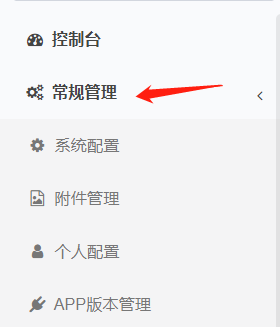

## 2.1 如何管理附件？

展开常规管理栏后，点击展开部分中的附件管理进入附件管理页面。
点击添加按钮打开添加页面，选择上传到本地选择本地文件地址即可完成附件添加。

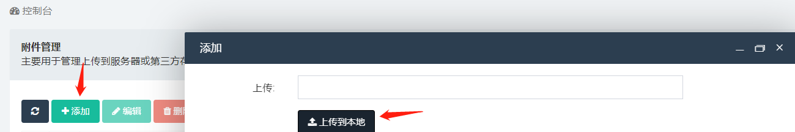

点击要修改的附件操作栏的编辑按钮，在打开的编辑页面中完成信息编辑后点击编辑页面最下方的确定按钮即可完成修改。

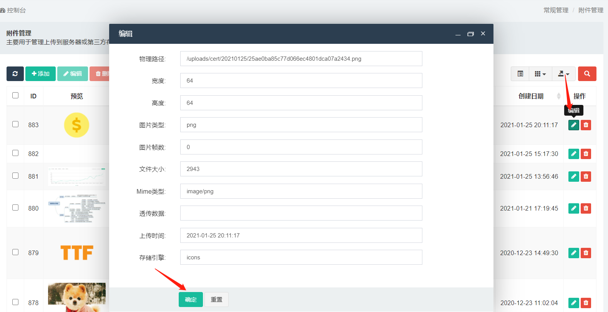

点击要删除的附件操作栏的删除按钮，在弹出的提示页面中确定即可完成删除。

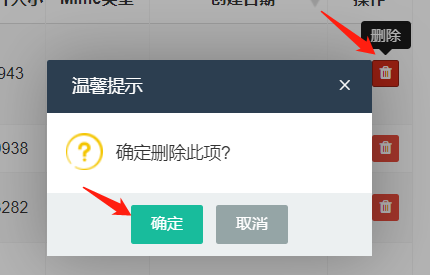

## 2.2 如何管理个人配置？

展开常规管理栏后，点击展开部分中的个人配置进入个人配置页面。
个人配置页面中，支持用户对邮箱地址，包体下载，昵称和密码进行修改。修改结束后点击下方“提交”按钮保存并应用修改，点击“重置”按钮则不保存本次修改重置回修改前的状态。特别的，若用户不想对密码进行修改，请保持密码栏留空。

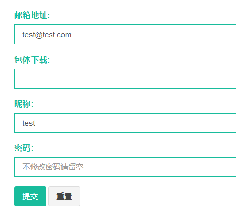

同时，修改密码页面也支持用户进行密码的修改。点击左侧导航栏中的“修改密码”进入修改密码界面，在密码栏和确认密码栏连续输入同样的新密码后点击“确定”即修改密码成功，点击“重置”则放弃修改继续使用修改前的密码。特别的，在本页面修改密码后用户会被强制退出平台，请使用新密码重新进行登录。

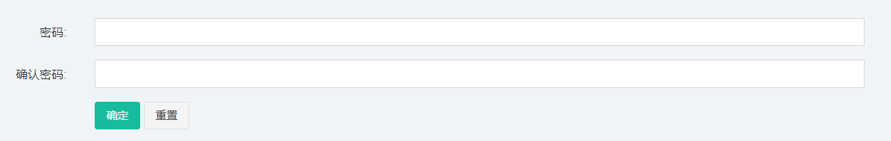

   

# 3 权限管理

点击左侧导航栏中的权限管理可将其展开。

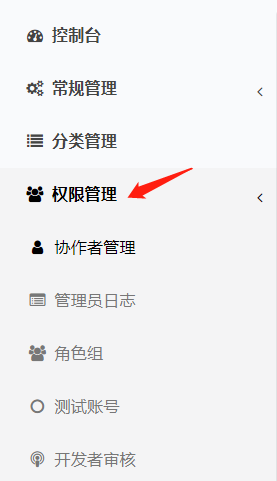

## 3.1 如何管理协作者？

展开权限管理栏后，点击展开部分中的协作者管理进入协作者管理页面。
点击添加按钮打开添加页面，在打开的添加页面中完善信息后点击添加页面最下方的确定按钮即可完成添加。

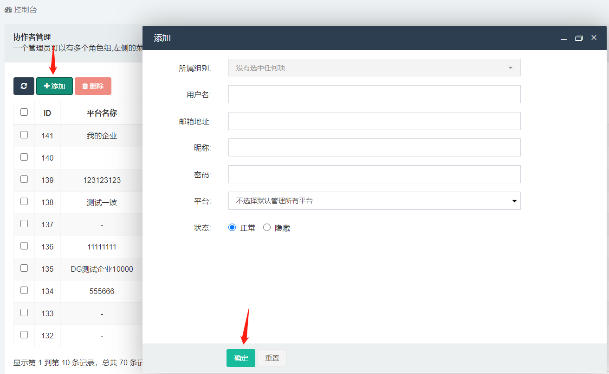

点击要修改的协作者操作栏的编辑按钮，在打开的编辑页面中完成信息编辑后点击编辑页面最下方的确定按钮即可完成修改。

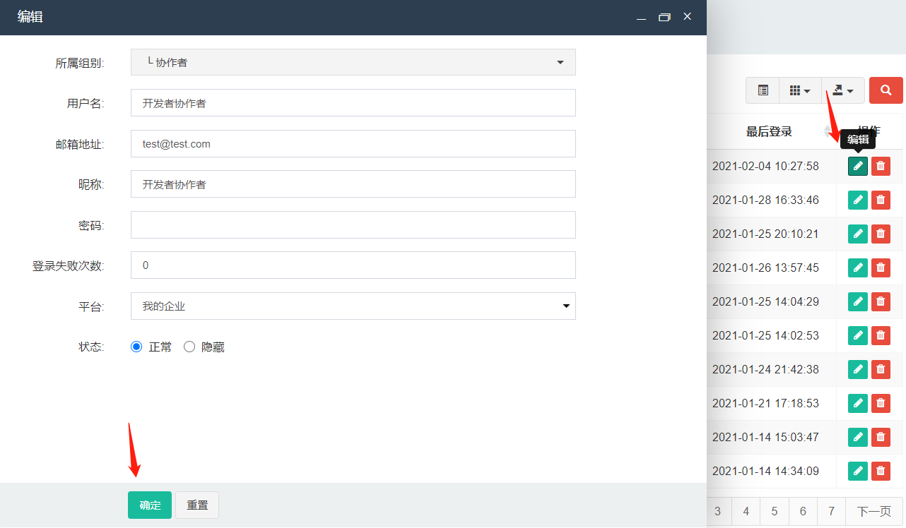

点击要删除的协作者操作栏的删除按钮，在弹出的提示页面中确定即可完成删除。

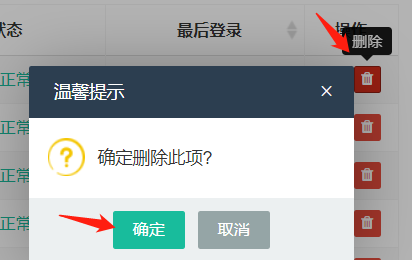

## 3.2 如何管理角色权限？

展开权限管理栏后，点击展开部分中的角色组进入角色组管理页面。
点击添加按钮打开添加页面，在打开的添加页面中完善信息后点击添加页面最下方的确定按钮即可完成添加。

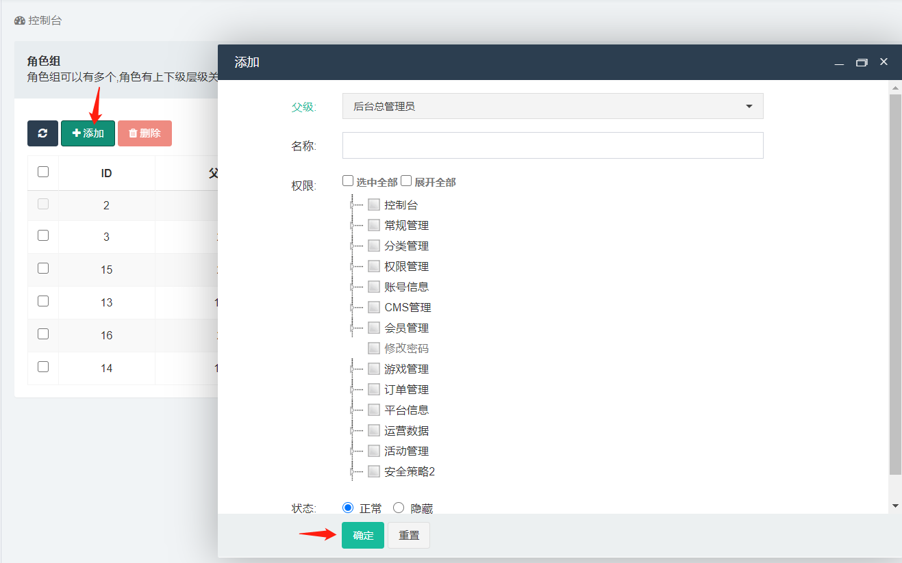

点击要修改的角色组操作栏的编辑按钮，在打开的编辑页面中完成信息编辑后点击编辑页面最下方的确定按钮即可完成修改。

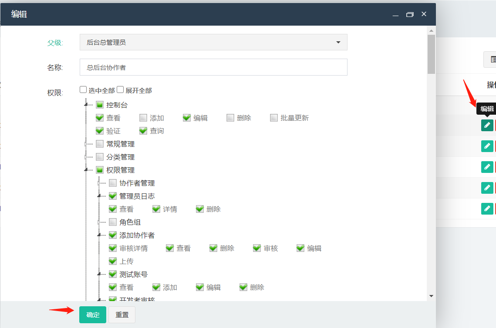

点击要删除的角色组操作栏的删除按钮，在弹出的提示页面中确定即可完成删除。

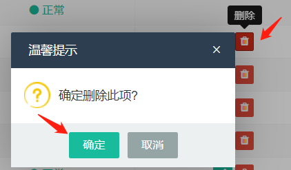

## 3.3 如何管理测试账号？

展开权限管理栏后，点击展开部分中的测试账号进入测试账号页面。
后续流程与管理员协作者使用流程2.1相同。

## 3.4 如何审核开发者？

展开权限管理栏后，点击展开部分中的开发者审核进入开发者审核页面。
后续流程与管理员协作者使用流程2.2相同。

# 4 CMS（内容管理系统）管理

点击左侧导航栏中的CMS管理可将其展开。

