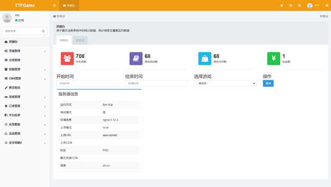
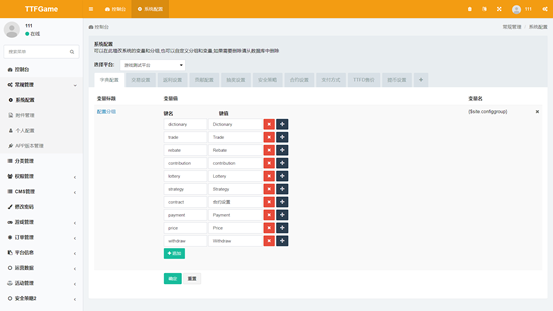

# 1 概述

管理员协作者账号为管理员用户所创建。管理员协作者通过开发者创建账号时设定的用户名和密码即可于TTFGame平台首页进行登录。管理员协作者无需过审即可直接正常使用平台功能。

   

# 2 权限管理

点击左侧导航栏中的权限管理可将其展开。

# 2.1 如何管理测试账号？

展开权限管理栏后，点击展开部分中的测试账号进入测试账号页面。
点击添加按钮打开添加页面，在打开的添加页面中完善信息后点击添加页面最下方的确定按钮即可完成添加。

点击要修改的测试账号操作栏的编辑按钮，在打开的编辑页面中完成信息编辑后点击编辑页面最下方的确定按钮即可完成修改。

点击要删除的测试账号操作栏的删除按钮，在弹出的提示页面中确定即可完成删除。

# 2.2 如何审核开发者？

展开权限管理栏后，点击展开部分中的开发者审核进入开发者审核页面。
点击要审核的信息操作栏的审核详情按钮进入审核详情页面。通过在该页面改变审核状态的方式来表明审核结果。修改审核状态并填写审核建议后点击审核详情最下方的确定按钮即保存审核结果。

点击要删除的审核信息操作栏的删除按钮，在弹出的提示页面中确定即可完成删除。

   

# 3 CMS管理

点击左侧导航栏中的CMS管理可将其展开。

## 3.1 如何管理栏目？

展开CMS管理栏后，点击展开部分中的栏目管理进入栏目管理页面。
因栏目管理中会使用到已创建的模型，建议进行栏目管理流程前先进行模型管理。
点击添加按钮打开添加页面，在打开的添加页面中完善信息后点击添加页面最下方的确定按钮即可完成添加。

点击要修改的栏目操作栏的编辑按钮，在打开的编辑页面中完成信息编辑后点击编辑页面最下方的确定按钮即可完成修改。

点击要删除的栏目操作栏的删除按钮，在弹出的提示页面中确定即可完成删除。

## 3.2 如何管理内容？

展开CMS管理栏后，点击展开部分中的内容管理进入内容管理页面。
因内容管理中会使用到已创建的栏目，建议进行内容管理流程前先进行栏目管理。
点击添加按钮打开添加页面，在打开的添加页面中完善信息后点击添加页面最下方的确定按钮即可完成添加。

点击要修改的内容操作栏的编辑按钮，在打开的编辑页面中完成信息编辑后点击编辑页面最下方的确定按钮即可完成修改。

点击要删除的内容操作栏的删除按钮，在弹出的提示页面中确定即可完成删除。

## 3.3 如何管理单页？

展开CMS管理栏后，点击展开部分中的单页管理进入单页管理页面。
点击添加按钮打开添加页面，在打开的添加页面中完善信息后点击添加页面最下方的确定按钮即可完成添加。

点击要修改的单页操作栏的编辑按钮，在打开的编辑页面中完成信息编辑后点击编辑页面最下方的确定按钮即可完成修改。

点击要删除的单页操作栏的删除按钮，在弹出的提示页面中确定即可完成删除。

   

# 4 游戏管理

点击左侧导航栏中的游戏管理可将其展开。

## 4.1 如何审核游戏？

展开游戏管理栏后，点击展开部分中的游戏管理进入游戏管理页面。
点击要审核的游戏操作栏的审核详情按钮进入审核详情页面。通过在该页面改变审核状态的方式来表明审核结果。修改审核状态并填写审核建议后点击审核详情最下方的确定按钮即保存审核结果。

## 4.2 如何发布或撤回游戏？

展开游戏管理栏后，点击展开部分中的游戏管理进入游戏管理页面。
只有审核状态为通过审核的游戏才支持进行发布，审核流程请参阅本使用流程4.1
审核状态为通过审核的游戏的操作栏会额外增加发布按钮，点击后在弹出的提示页面中确定即可进行游戏发布。

已发布的游戏操作栏中的发布会变为游戏撤回，点击后在弹出的提示页面中确定即可进行游戏撤回。

## 4.3 如何管理游戏类型？

展开游戏管理栏后，点击展开部分中的类型管理进入类型管理页面。
点击添加按钮打开添加页面，在打开的添加页面中完善信息后点击添加页面最下方的确定按钮即可完成添加。

点击要修改的类型操作栏的编辑按钮，在打开的编辑页面中完成信息编辑后点击编辑页面最下方的确定按钮即可完成修改。

点击要删除的类型操作栏的删除按钮，在弹出的提示页面中确定即可完成删除。

## 4.4 如何管理游戏轮播图？

展开游戏管理栏后，点击展开部分中的轮播图管理进入轮播图管理页面。
点击添加按钮打开添加页面，在打开的添加页面中完善信息后点击添加页面最下方的确定按钮即可完成添加。

点击要修改的轮播图操作栏的编辑按钮，在打开的编辑页面中完成信息编辑后点击编辑页面最下方的确定按钮即可完成修改。

点击要删除的轮播图操作栏的删除按钮，在弹出的提示页面中确定即可完成删除。

## 4.5 如何管理游戏礼包？

展开游戏管理栏后，点击展开部分中的礼包管理进入礼包管理页面。
点击添加按钮打开添加页面，在打开的添加页面中完善信息后点击添加页面最下方的确定按钮即可完成添加。

点击要修改的礼包操作栏的编辑按钮，在打开的编辑页面中完成信息编辑后点击编辑页面最下方的确定按钮即可完成修改。

点击要删除的礼包操作栏的删除按钮，在弹出的提示页面中确定即可完成删除。

## 4.6 如何管理游戏商品？

展开游戏管理栏后，点击展开部分中的商品管理进入商品管理页面。
点击添加按钮打开添加页面，在打开的添加页面中完善信息后点击添加页面最下方的确定按钮即可完成添加。

点击要修改的商品操作栏的编辑按钮，在打开的编辑页面中完成信息编辑后点击编辑页面最下方的确定按钮即可完成修改。

点击要删除的商品操作栏的删除按钮，在弹出的提示页面中确定即可完成删除。

   

# 5 平台信息

点击左侧导航栏中的平台信息可将其展开。

## 5.1 如何管理平台通知？

展开平台信息栏后，点击展开部分中的平台通知进入平台通知管理页面。
点击添加按钮打开添加页面，在打开的添加页面中完善信息后点击添加页面最下方的确定按钮即可完成添加。

点击要修改的平台通知操作栏的编辑按钮，在打开的编辑页面中完成信息编辑后点击编辑页面最下方的确定按钮即可完成修改。

## 5.2 如何处罚开发者？

展开平台信息栏后，点击展开部分中的开发者处罚记录进入开发者处罚管理页面。
点击添加按钮打开添加页面，在打开的添加页面中完善信息后点击添加页面最下方的确定按钮即可完成添加。

点击要修改的处罚操作栏的编辑按钮，在打开的编辑页面中完成信息编辑后点击编辑页面最下方的确定按钮即可完成修改。

点击要删除的处罚操作栏的删除按钮，在弹出的提示页面中确定即可完成删除。

## 5.3 如何管理平台？

展开平台信息栏后，点击展开部分中的平台管理进入平台管理页面。
点击添加按钮打开添加页面，在打开的添加页面中完善信息后点击添加页面最下方的确定按钮即可完成添加。

点击要修改的平台操作栏的编辑按钮，在打开的编辑页面中完成信息编辑后点击编辑页面最下方的确定按钮即可完成修改。

点击要删除的平台操作栏的删除按钮，在弹出的提示页面中确定即可完成删除。

   

# 6 活动管理

点击左侧导航栏中的活动管理可将其展开。

## 6.1 如何管理积分抽奖？

展开活动管理栏后，点击展开部分中的积分抽奖管理进入积分抽奖管理页面。
点击添加按钮打开添加页面，在打开的添加页面中完善信息后点击添加页面最下方的确定按钮即可完成添加。

点击要修改的积分抽奖信息操作栏的编辑按钮，在打开的编辑页面中完成信息编辑后点击编辑页面最下方的确定按钮即可完成修改。

点击要删除的积分抽奖信息操作栏的删除按钮，在弹出的提示页面中确定即可完成删除。

## 6.2 如何管理合约？

展开活动管理栏后，点击展开部分中的合约管理进入合约管理页面。
点击添加按钮打开添加页面，在打开的添加页面中完善信息后点击添加页面最下方的确定按钮即可完成添加。

点击要修改的合约操作栏的编辑按钮，在打开的编辑页面中完成信息编辑后点击编辑页面最下方的确定按钮即可完成修改。

点击要删除的合约操作栏的删除按钮，在弹出的提示页面中确定即可完成删除。

   